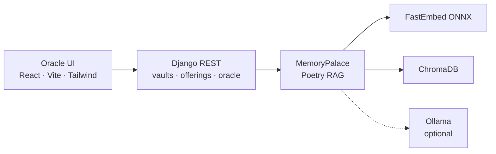

<div align="center">
  
</div>

<br>

<div align="center">

[](rag/pyproject.toml)
[](backend/README.md)
[](frontend/README.md)
[](#the-rite)

**A memory palace on your machine.**  
Inscribe documents. Embed them locally. Ask by intent.  
The vault does not invent. It recalls.

[Enter the vaults](#run) · [The rite](#the-rite) · [API](#oracle-api)

</div>

---

## The rite

Three motions. One palace. Nothing is sent away unless you wake [Ollama](https://ollama.com/) yourself.

| | Inscribe | Remember | Ask |
| --- | --- | --- | --- |
| **What** | Markdown, text, or PDF is laid on a vault and split into overlapping shards | Each shard becomes a vector with `BAAI/bge-small-en-v1.5` (ONNX, on disk) | A question is embedded the same way; nearest shards surface |
| **Where** | `rag/` · `backend/` | ChromaDB under `data/palace` | `POST /api/vaults/:id/search/` and `/ask/` |



<div align="center">

| Chamber | Stack | Role |
| --- | --- | --- |
| [`rag/`](rag/README.md) | Poetry · ChromaDB · FastEmbed | Local embeddings, ingest, semantic retrieval |
| [`backend/`](backend/README.md) | Django · DRF · CORS | HTTP vaults over the palace |
| [`frontend/`](frontend/README.md) | React · Vite · pnpm · Tailwind | Gold-leaf oracle UI |

</div>

## Run

Requirements: **Python 3.11–3.13**, [Poetry](https://python-poetry.org/), **Node 20+**, [pnpm](https://pnpm.io/).

```bash
cd rag && poetry install
cd ../backend && poetry install
cp .env.example .env
poetry run python manage.py migrate
poetry run python manage.py seed_memory
poetry run python manage.py runserver 8000
```

```bash
cd frontend
pnpm install
pnpm dev
```

Open [http://127.0.0.1:5173](http://127.0.0.1:5173). Vite proxies `/api` to Django.

> The first non-lexical ingest downloads `BAAI/bge-small-en-v1.5` and keeps it on disk.  
> Set `MNEMOSYNE_LEXICAL=true` in `backend/.env` if you want a first run without that download.

Without Ollama, the oracle answers **extractively** from cited shards. With Ollama on `127.0.0.1:11434`, it may compose a **generative** reply still grounded in those shards.

## Oracle API

| Method | Path | Rite |
| --- | --- | --- |
| `GET` | `/api/health/` | Pulse of the palace |
| `GET` `POST` | `/api/vaults/` | List / inscribe vaults |
| `GET` `PATCH` `DELETE` | `/api/vaults/:id/` | Chamber detail |
| `GET` `POST` | `/api/vaults/:id/documents/` | List / offer manuscripts |
| `DELETE` | `/api/vaults/:id/documents/:doc_id/` | Forget a document |
| `POST` | `/api/vaults/:id/search/` | Semantic search |
| `POST` | `/api/vaults/:id/ask/` | RAG answer with citations |

```bash
curl -s http://127.0.0.1:8000/api/health/
# {"name":"mnemosyne","status":"awake","embedder":"fastembed"}
```

## Tests

```bash
cd rag && poetry run pytest
cd backend && MNEMOSYNE_LEXICAL=true poetry run python manage.py test
cd frontend && pnpm build
```

## Why Mnemosyne

Poets drank from her spring so the song would not dissolve into Lethe.  
This palace is that spring, compiled: **local RAG**, **semantic search**, and an oracle that only speaks from what you inscribed.

<p align="center"><i>Drink before you speak.</i></p>
