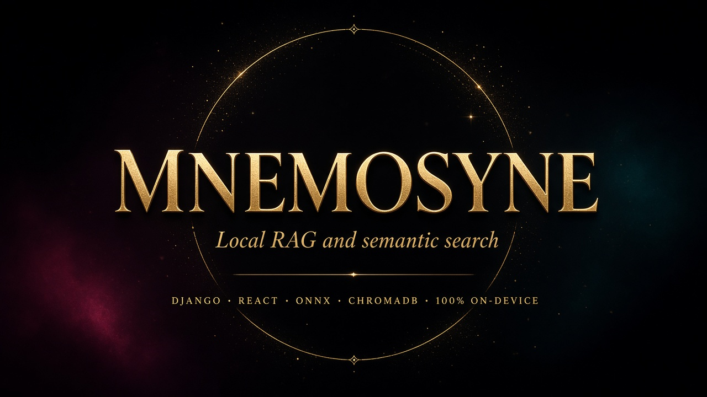
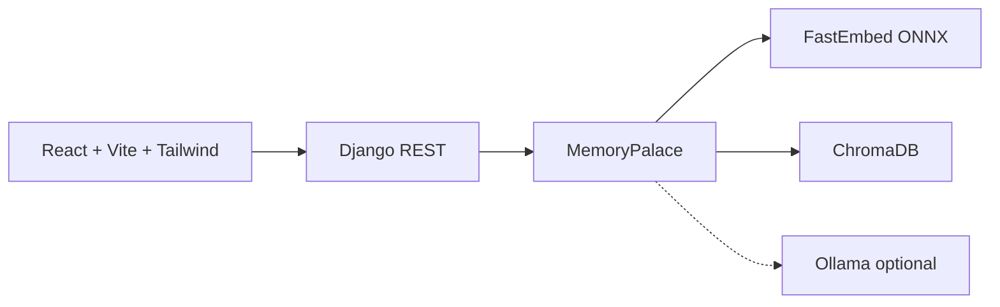

# Mnemosyne

**Local RAG and semantic search.** Upload documents, retrieve by meaning, and get cited answers — embeddings, index, API, and UI all run on your machine. No OpenAI key. No data leaving the laptop.

[](rag/pyproject.toml)
[](backend/README.md)
[](frontend/README.md)
[](frontend/package.json)
[](backend/pyproject.toml)

## Why this exists

Most RAG demos are a notebook plus a hosted model. Mnemosyne is a full product loop you can clone and run:

1. **Ingest** — markdown, text, or PDF → overlapping chunks  
2. **Index** — local ONNX embeddings (`BAAI/bge-small-en-v1.5`) stored in ChromaDB  
3. **Retrieve** — semantic search by intent, not keywords  
4. **Answer** — extractive citations by default; optional [Ollama](https://ollama.com/) if you want generation

Privacy is the default: the index lives on disk. A remote model is used only if you start Ollama yourself.

## What you can do

- Create **vaults** (document collections)
- Upload files and watch them get chunked and indexed
- **Semantic search** with scores and source passages
- **Ask** a question and receive an answer grounded in those passages
- Drop Ollama in later without changing the retrieval pipeline

## Architecture



| Package | Stack | Responsibility |
| --- | --- | --- |
| [`rag/`](rag/README.md) | Poetry, FastEmbed, ChromaDB, pypdf | Embeddings, ingest, retrieval, optional generation |
| [`backend/`](backend/README.md) | Django, DRF, CORS | Vaults, uploads, search/ask HTTP API |
| [`frontend/`](frontend/README.md) | React, Vite, pnpm, Tailwind | Vault UI, upload, oracle, citations |

## Quick start

**Python 3.11–3.13**, [Poetry](https://python-poetry.org/), **Node 20+**, [pnpm](https://pnpm.io/).

```bash
cd rag && poetry install
cd ../backend && poetry install
cp .env.example .env
poetry run python manage.py migrate
poetry run python manage.py seed_memory
poetry run python manage.py runserver 8000
```

```bash
cd frontend
pnpm install
pnpm dev
```

App: [http://127.0.0.1:5173](http://127.0.0.1:5173) · API: [http://127.0.0.1:8000/api/](http://127.0.0.1:8000/api/)

The first real ingest downloads the ONNX embedding model and caches it. For a first run without that download, set `MNEMOSYNE_LEXICAL=true` in `backend/.env`.

## API

| Method | Path | Purpose |
| --- | --- | --- |
| `GET` | `/api/health/` | Health check |
| `GET` `POST` | `/api/vaults/` | List / create vaults |
| `GET` `PATCH` `DELETE` | `/api/vaults/:id/` | Vault detail |
| `GET` `POST` | `/api/vaults/:id/documents/` | List / upload documents |
| `DELETE` | `/api/vaults/:id/documents/:doc_id/` | Delete a document from the index |
| `POST` | `/api/vaults/:id/search/` | Semantic search |
| `POST` | `/api/vaults/:id/ask/` | RAG answer + citations |

```bash
curl -s http://127.0.0.1:8000/api/health/
# {"name":"mnemosyne","status":"awake","embedder":"fastembed"}
```

## Tests

```bash
cd rag && poetry run pytest
cd backend && MNEMOSYNE_LEXICAL=true poetry run python manage.py test
cd frontend && pnpm build
```
